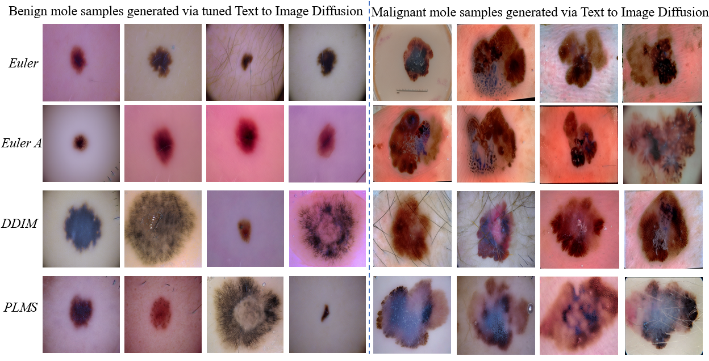
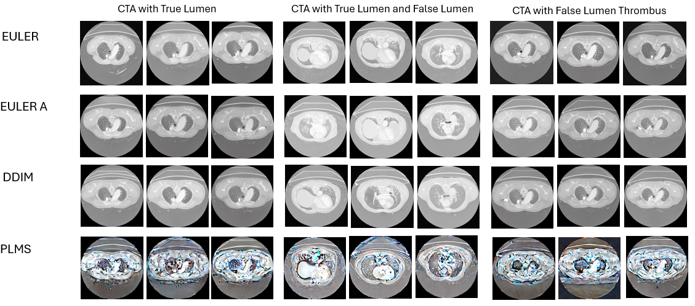
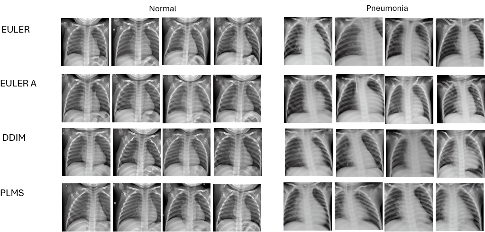

# Diffusion-Sampling-for-Medical-Image-Synthesis

Diffusion sampling is a powerful approach for medical image synthesis, leveraging a gradual noise-adding and noise-removal process to generate high-quality synthetic images. By starting from random noise and iteratively refining it through learned denoising steps, diffusion models can accurately capture the complex structures found in medical data such as CT scans, MRIs, and dermoscopic images. This technique is particularly effective for generating realistic images while maintaining anatomical coherence, which is crucial for applications like disease modeling, anomaly detection, and data augmentation in healthcare.

In this project We employed various diffusion sampling methods, including Euler, Euler A, PLMS, and DDIM, to render synthetic medical images across different modalities such as dermoscopic images, CTA scans, and chest X-rays. Each sampling method offered unique advantages in terms of image quality, noise control, and computational efficiency, enabling us to generate high-fidelity images that accurately reflect the underlying anatomical structures. These methods enhanced the diversity and realism of the synthetic datasets, making them valuable for downstream tasks such as training AI models for diagnosis and detection.

The below figures illustrates the data synthetic results using all four sampling methods for three different imaging modalites.

